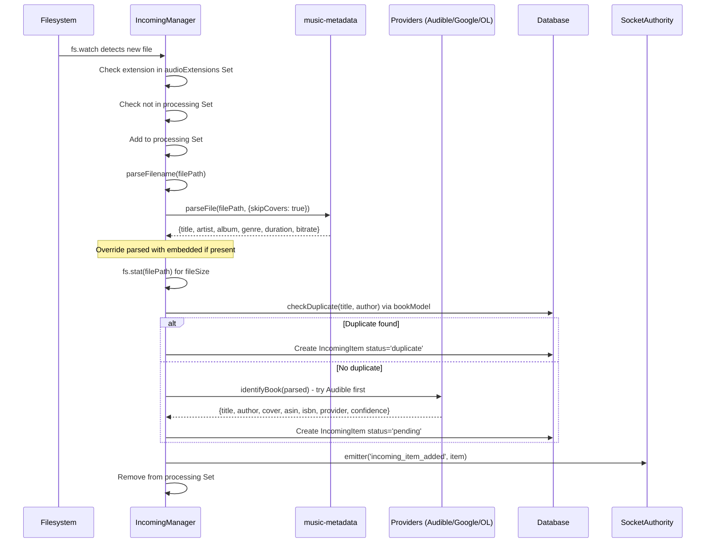
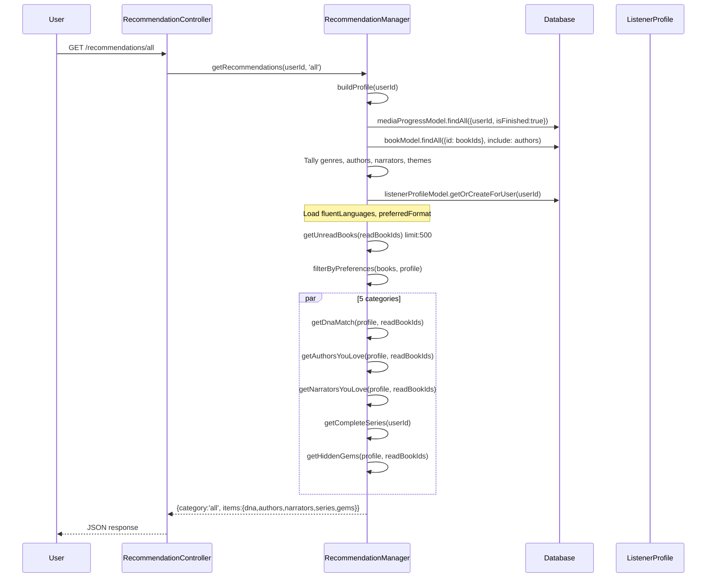
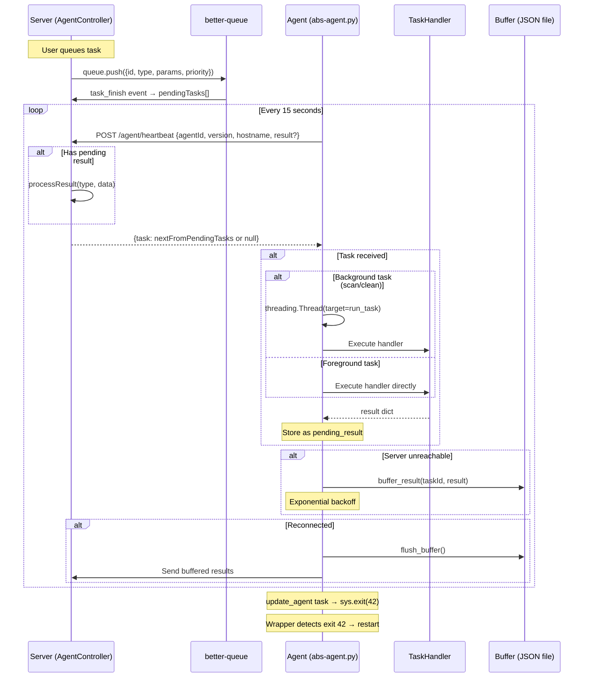
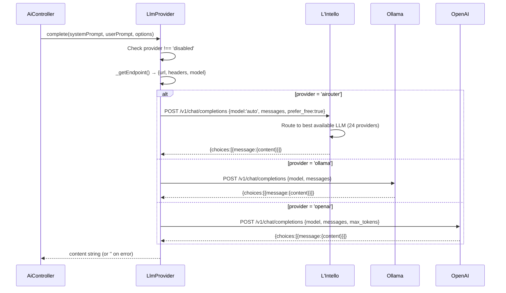
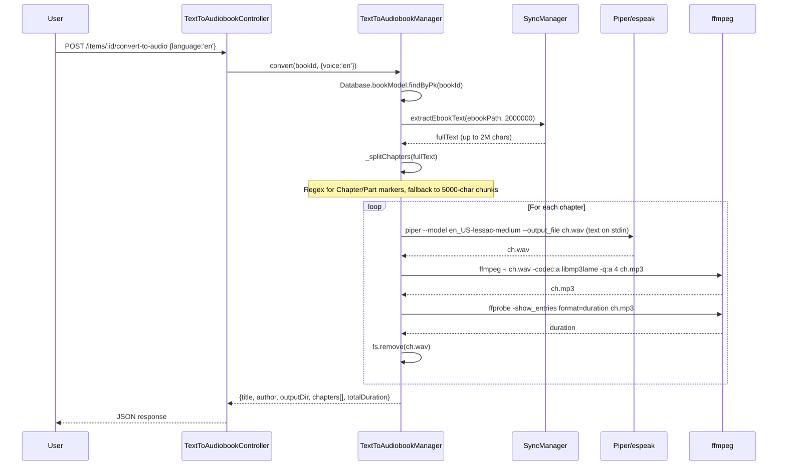
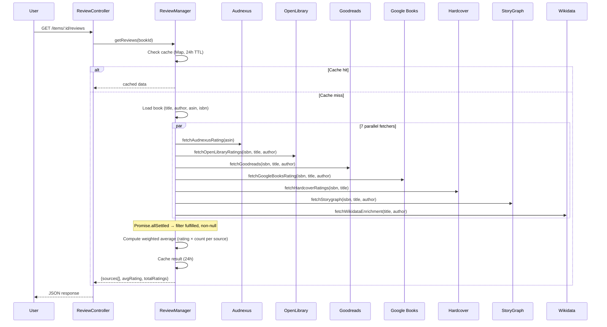
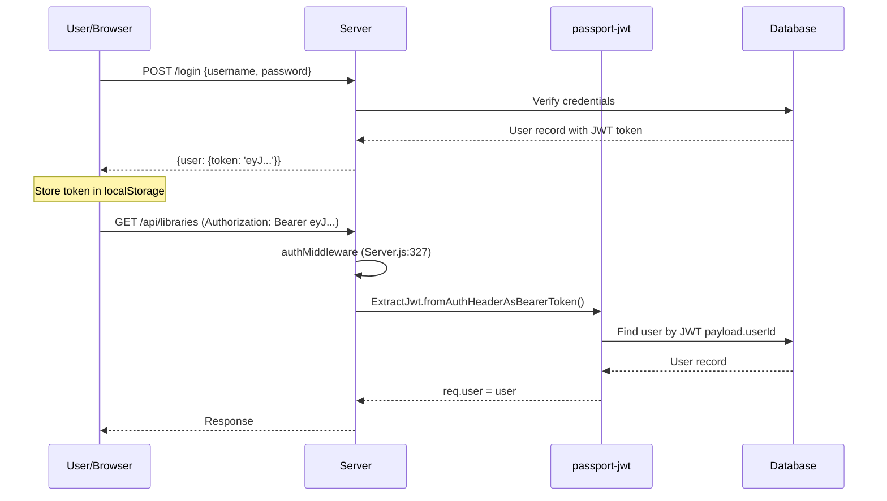

# Architectural Design — Audiobookshelf Extended (Deep-Dive)

## 1. System Architecture

```
┌──────────────────────────────────────────────────────────────────────┐
│                           Docker Host                                │
│  ┌──────────────────────────────┐  ┌──────────────────────────────┐  │
│  │  Audiobookshelf (Node.js)    │  │  L'Intello (Python/FastAPI)  │  │
│  │  Port 80 (mapped 13378)      │  │  Port 8000                   │  │
│  │                              │  │  - 24 LLM providers          │  │
│  │  ┌────────┐  ┌────────────┐  │  │  - OCR (Tesseract/OCRmyPDF) │  │
│  │  │Upstream│  │ Extended   │  │  │  - OpenAI-compat /v1/chat    │  │
│  │  │96K LOC │  │ 6.4K LOC   │  │  └──────────────────────────────┘  │
│  │  │        │  │ 21 managers│  │                                     │
│  │  │        │  │ 19 ctrls   │  │  ┌──────────────────────────────┐  │
│  │  │        │  │ 2 providers│  │  │  Agent (Python)              │  │
│  │  │        │  │ 2 models   │  │  │  - 15 task types             │  │
│  │  └────────┘  └────────────┘  │  │  - Path mappings             │  │
│  │                              │  │  - Offline buffering          │  │
│  │  Client v2 (/) + v3 (/v3/)  │  │  - Background threads        │  │
│  └──────────────────────────────┘  └──────────────────────────────┘  │
│                                                                       │
│  Volumes: /audiobooks /config /metadata /incoming (all persistent)    │
└──────────────────────────────────────────────────────────────────────┘
```

## 2. Mermaid Sequence Diagrams

### 2.1 Incoming File Processing



### 2.2 Recommendation Engine



### 2.3 Agent Task Lifecycle



### 2.4 LLM Request Routing



### 2.5 Ebook → Audiobook Pipeline



### 2.6 Review Aggregation




## 3. Type Definitions

### 3.1 Database Models

#### IncomingItem
| Column | Type | Constraints |
|--------|------|-------------|
| id | UUID | PK, default UUIDV4 |
| filePath | STRING | NOT NULL |
| fileName | STRING | NOT NULL |
| fileSize | BIGINT | |
| fileFormat | STRING | |
| parsedTitle | STRING | |
| parsedAuthor | STRING | |
| parsedSeries | STRING | |
| parsedSequence | STRING | |
| matchedTitle | STRING | |
| matchedAuthor | STRING | |
| matchedCover | STRING | |
| matchedAsin | STRING | |
| matchedIsbn | STRING | |
| matchProvider | STRING | |
| matchConfidence | FLOAT | |
| status | STRING | NOT NULL, DEFAULT 'pending' |
| libraryId | UUID | FK → libraries ON DELETE SET NULL |
| createdAt | DATE | NOT NULL |
| updatedAt | DATE | NOT NULL |

#### ListenerProfile
| Column | Type | Constraints |
|--------|------|-------------|
| id | UUID | PK, default UUIDV4 |
| userId | UUID | NOT NULL, UNIQUE, FK → users ON DELETE CASCADE |
| favoriteGenres | JSON | DEFAULT [] |
| favoriteAuthors | JSON | DEFAULT [] |
| favoriteNarrators | JSON | DEFAULT [] |
| themeKeywords | JSON | DEFAULT [] |
| avgBookLength | FLOAT | |
| totalListeningTime | FLOAT | DEFAULT 0 |
| booksFinished | INTEGER | DEFAULT 0 |
| fluentLanguages | JSON | DEFAULT [] |
| secondaryLanguages | JSON | DEFAULT [] |
| includeEbooks | BOOLEAN | DEFAULT true |
| preferredFormat | STRING | DEFAULT 'all' |
| lastCalculatedAt | DATE | |

### 3.2 API Response Contracts

#### Agent Heartbeat
```typescript
// Request: POST /api/agent/heartbeat
interface HeartbeatRequest {
  agentId: string          // required
  version: string
  hostname: string
  result?: {
    taskId: string
    type: string
    data: Record<string, any>
  }
}
// Response
interface HeartbeatResponse {
  task: { id: string, type: string, params: Record<string, any>, priority: number } | null
}
```

#### Auto-Tag
```typescript
// Response: POST /api/items/:id/auto-tag
interface AutoTagResponse {
  genres: string[]           // 2-5
  subgenres: string[]        // 2-4
  mood: string[]             // 2-4
  themes: string[]           // 3-6
  pace: 'slow' | 'medium' | 'fast'
  targetAudience: 'adult' | 'young-adult' | 'children'
  contentWarnings: string[]
  setting: string
  similar: string[]          // 2-3 well-known books
  oneLiner: string
  _bookId: string
  _title: string
  _samplesUsed: number       // 5 (beginning + 3 middle + end)
}
```

#### Book Summary
```typescript
// Response: POST /api/items/:id/summary
interface BookSummaryResponse {
  title: string
  author: string
  oneLiner: string
  keyInsight: string
  summary: string            // 3-5 paragraphs
  keyPoints: string[]        // 5-10
  actionItems: string[]      // 3-5 (non-fiction)
  quotes: string[]           // 3-5
  whoShouldRead: string
  readingTime: string
}
```

#### Reviews
```typescript
// Response: GET /api/items/:id/reviews
interface ReviewsResponse {
  sources: Array<{
    source: string           // 'Audible' | 'OpenLibrary' | 'Goodreads' | 'Google Books' | 'Hardcover' | 'StoryGraph' | 'Wikidata'
    rating: number           // 0-5
    ratingCount: number
    reviews: string[]
    url: string
    enrichment?: {           // Wikidata only
      genres: string[]
      awards: string[]
      originalLanguage: string
      publicationDate: string
    }
  }>
  avgRating: number
  totalRatings: number
}
```

#### Quality Analysis
```typescript
interface QualityAnalysis {
  score: number              // 0-100
  bitrate: number            // avg kbps
  hasChapters: boolean
  format: string | null
  channels: number
  issues: string[]
}
```

#### Name Normalizer
```typescript
interface ParsedName {
  first: string
  last: string
  full: string
  suffix?: string
}
// parseName(str) → ParsedName
// normalizeName(str) → string (canonical lowercase)
// namesMatch(a, b) → boolean
// formatName(parsed, 'first-last'|'last-first'|'last-only'|'short') → string
```

#### LLM Status
```typescript
// Response: GET /api/ai/status
interface LlmStatus {
  available: boolean
  provider: 'airouter' | 'ollama' | 'openai' | 'custom' | 'disabled'
  reason?: string
  config: {
    airouter: { url: string, hasToken: boolean }
    ollama: { url: string, model: string }
    openai: { url: string, hasKey: boolean, model: string }
    custom: { url: string, hasKey: boolean, model: string }
  }
}
```

### 3.3 Agent Task Contracts

| Task | Params | Returns |
|------|--------|---------|
| scan_incoming | `{path, min_size?:1000000}` | `{files: [{path, filename, size, parsed: {author, title, series, sequence}}]}` |
| audio_quality | `{paths[]}` | `{checked, data: {[path]: {duration, bitrate, format, codec, channels, has_chapters, chapter_count, size}}}` |
| audio_identify | `{path}` | `{path, title, artist, album, genre, date, duration}` |
| audio_diagnose | `{path, sample_duration?:10}` | `{path, recommendation, reason, score, details: {noise_floor_dB, high_freq_energy_dB, dynamic_range_dB}, samples_analyzed, total_duration}` |
| audio_clean | `{path, profile, keep_original?:true, output_format?:'same'}` | `{path, profile, elapsed, old_size, new_size, kept_original}` |
| audio_auto_clean | `{path, keep_original?:true, min_score?:20}` | `{path, action:'cleaned'\|'skipped', score, diagnosis?}` |
| audio_auto_clean_folder | `{path, keep_original?:true, min_score?:20}` | `{path, total, cleaned, skipped, errors, files[]}` |
| find_duplicates | `{path, recursive?:true, min_size?:100000}` | `{path, totalFiles, duplicateGroups, totalWastedBytes, groups: [{size, hash, count, files[], wastedBytes}]}` |
| move_file | `{source, destination}` | `{moved:true, source, destination}` |
| download_metadata | `{title}` | `{query, results: [{title, author, year, isbn, cover_id}]}` |
| diag | `{paths?[]}` | `{platform, python, hostname, agent_version, path_mappings, paths, disk_free, ffprobe}` |
| update_agent | `{code, path?}` | `{updated, size, _restart:true}` |


## 4. Physical File → Component Mapping

### 4.1 Server Managers (21 new)

| File | Dependencies | Purpose |
|------|-------------|---------|
| `server/managers/IncomingManager.js` | music-metadata, fs, providers, Database, SocketAuthority | Folder watcher, file processing, provider matching |
| `server/managers/RecommendationManager.js` | natural, string-similarity, Database | Taste profiles, 5 recommendation categories, language/format filtering |
| `server/managers/QualityManager.js` | Database | Audio quality scoring, series gaps, narrator consistency |
| `server/managers/ReviewManager.js` | axios | 7-source rating aggregation with 24h cache |
| `server/managers/SocialManager.js` | Database, SocketAuthority | Activity feed, taste comparison, collaborative filtering |
| `server/managers/DeliveryManager.js` | xmlbuilder2, EmailManager | Kindle/Kobo/OPDS delivery, mobile links |
| `server/managers/GroupingManager.js` | string-similarity, nameNormalizer | Split chapter detection, duplicate detection, file merging |
| `server/managers/ConversionManager.js` | child_process | Calibre ebook-convert wrapper |
| `server/managers/SyncManager.js` | string-similarity, natural, child_process | Whisper STT, audiobook↔ebook matching, chapter alignment |
| `server/managers/LanguageLearningManager.js` | sbd, child_process | Cross-language text/audio interleaving |
| `server/managers/BookCompanionManager.js` | LlmProvider, Database | AI recap, chat, character tracking, smart search |
| `server/managers/LlmProvider.js` | axios | Unified LLM client (airouter/ollama/openai/custom/disabled) |
| `server/managers/AutoTagManager.js` | LlmProvider, SyncManager | Multi-sample LLM tagging (5 text points) |
| `server/managers/BookSummaryManager.js` | LlmProvider, child_process | Structured summaries + TTS audio |
| `server/managers/ModernizeManager.js` | LlmProvider, SyncManager | Archaic text modernization (4 styles) |
| `server/managers/TextToAudiobookManager.js` | child_process (piper/espeak, ffmpeg) | Ebook → audiobook via TTS |
| `server/managers/OcrManager.js` | axios | OCR client for L'Intello |
| `server/managers/LibriVoxManager.js` | LibriVox provider, htmlparser2, axios | Free audiobook catalog + download |
| `server/managers/GutenbergManager.js` | Gutenberg provider, axios | Free ebook catalog + download |
| `server/managers/RatingImportManager.js` | axios, Database | Goodreads CSV / OpenLibrary import |
| `server/managers/ScheduledFeedManager.js` | Database, RssFeedManager | Drip-feed podcast scheduling |

### 4.2 Server Controllers (19 new)

| File | Manager(s) | Routes |
|------|-----------|--------|
| `AgentController.js` | better-queue | /agent/heartbeat, /tasks, /agents |
| `AiController.js` | LlmProvider, BookCompanionManager | /ai/status, /config, /recap, /search, /ask, /character, /check-alignment, /chapter-summary |
| `AutoTagController.js` | AutoTagManager | /items/:id/auto-tag, /auto-tag/apply, /libraries/:id/auto-tag |
| `BookSummaryController.js` | BookSummaryManager | /items/:id/summary, /summary/audio, /summary/versions |
| `DeliveryController.js` | DeliveryManager | /items/:id/send-to-kindle, /send-to-device, /mobile-links, /opds/* |
| `GutenbergController.js` | GutenbergManager | /gutenberg/search, /browse, /:id, /:id/download |
| `IncomingController.js` | IncomingManager, Database | /incoming, /pending, /:id/confirm, /:id/reject, /scan |
| `IntelligenceController.js` | QualityManager, SocialManager, Database | /intelligence/library/:id/*, /stats, /space-savers, /activity, /compare, /community-recommendations |
| `LanguageLearningController.js` | LanguageLearningManager | /language/interleave-text, /interleave-audio, /align |
| `LibraryToolsController.js` | GroupingManager, ConversionManager | /tools/groups, /duplicates, /convert, /convert-all, /conversion-check, /extract-metadata |
| `LibriVoxController.js` | LibriVoxManager | /librivox/search, /browse, /:id, /:id/download |
| `ModernizeController.js` | ModernizeManager | /items/:id/modernize, /modernize/preview, /modernize/versions |
| `OcrController.js` | OcrManager | /ocr/status, /items/:id/ocr, /items/:id/ocr/text |
| `RatingImportController.js` | RatingImportManager | /ratings/import/goodreads, /openlibrary, /status |
| `RecommendationController.js` | RecommendationManager, Database | /recommendations/:category, /profile, /profile/preferences, /profile/rebuild |
| `ReviewController.js` | ReviewManager | /items/:id/reviews |
| `ScheduledFeedController.js` | ScheduledFeedManager | /items/:id/podcast-feed, /feeds/:id/schedule |
| `SyncController.js` | SyncManager | /sync/check, /pairs, /verify, /chapters |
| `TextToAudiobookController.js` | TextToAudiobookManager | /items/:id/convert-to-audio, /convert-to-audio/status |

### 4.3 Other New Files

| File | Purpose |
|------|---------|
| `server/providers/LibriVox.js` | LibriVox API client (search, getById, getByAuthor, getRecent) |
| `server/providers/Gutenberg.js` | Gutendex API client (search, getById, getPopular, getBySubject) |
| `server/models/IncomingItem.js` | Sequelize model with getByStatus(), getPending() |
| `server/models/ListenerProfile.js` | Sequelize model with getOrCreateForUser() |
| `server/utils/asyncHandler.js` | asyncHandler (wraps 63 methods) + friendlyError (maps 15+ error patterns) |
| `server/utils/nameNormalizer.js` | parseName, normalizeName, namesMatch, formatName |
| `server/migrations/v2.34.0-*.js` | Creates incomingItems + listenerProfiles tables |
| `server/migrations/v2.34.1-*.js` | Adds language/format columns to listenerProfiles |
| `agent/abs-agent.py` | Python agent (15 task types, 988 lines) |
| `agent/abs-wrapper.py` | Supervisor (exit 42=restart, non-zero=retry, 0=stop) |
| `agent/Dockerfile.agent` | python:3.12-slim + ffmpeg |
| `agent/setup-windows.ps1` | Windows deployment with scheduled task |
| `scripts/setup-cloud-storage.sh` | rclone setup for 7+ cloud providers |
| `scripts/migrate-vue.js` | Vue 2→3 migration analysis tool |

### 4.4 Client v3 Pages

| File | API Endpoints Used | Purpose |
|------|-------------------|---------|
| `pages/index.vue` | /ai/status, /agent/agents, /intelligence/activity | Dashboard |
| `pages/library.vue` | /libraries, /libraries/:id/items | Library with All/Audio/Ebook filter |
| `pages/book/[id].vue` | /items/:id/reviews, /ai/recap, /ai/ask, /ai/character, /items/:id/auto-tag, /auto-tag/apply, /send-to-kindle, /send-to-device, /mobile-links, /items/:id/summary, /summary/audio, /modernize/preview, /modernize, /convert-to-audio, /convert-to-audio/status, /ocr, /podcast-feed | Book detail (8 tabs) |
| `pages/incoming.vue` | /incoming/pending, /incoming/:id/confirm, /incoming/:id/reject, /incoming/scan | Pending items |
| `pages/discover.vue` | /recommendations/all, /librivox/search, /librivox/:id/download, /items/:id/reviews | Recommendations + LibriVox + Reviews |
| `pages/intelligence.vue` | /intelligence/library/:id/quality, /series-gaps, /narrator-consistency, /tools/duplicates, /intelligence/stats | Library intelligence |
| `pages/language.vue` | /language/align, /language/interleave-text, /language/interleave-audio | Language learning |
| `pages/settings.vue` | /ai/status, /ai/config, /ocr/status, /agent/agents, /tools/conversion-check, /sync/check | Configuration |

## 5. Technical Debt Inventory

### 5.1 Upstream TODOs (in controllers we didn't modify)
| Location | Issue |
|----------|-------|
| CollectionController.js:261 | bookId is actually libraryItemId — clients need updating |
| CustomMetadataProviderController.js:58,95 | Unnecessary emit to all clients? |
| LibraryController.js:626 | Temporary collapse sub-series handling |
| LibraryController.js:832 | Create paginated queries |
| MeController.js:150,172,340 | Update to use mediaItemId and mediaItemType |
| MiscController.js:654 | Better validation of auth settings |
| PlaylistController.js:126 | Remove endpoint or make it primary |
| PodcastController.js:487 | Watcher trigger on episode delete |
| SeriesController.js:29 | Update mobile app to use different route |
| SeriesController.js:65 | Check for duplicate series name |
| constants.js:51 | Switch to audio/matroska mime type |
| ffmpegHelpers.js:447 | Always-encode option for m4b merge |

### 5.2 Our Technical Debt
| Issue | Severity | Location |
|-------|----------|----------|
| Vue 3 client auth reads localStorage.token but blank page reported | High | client-v3/composables/useApi.ts |
| 141 routes without per-route middleware (rely on global auth) | Medium | server/routers/ApiRouter.js |
| IntelligenceController queries not paginated for large libraries | Medium | server/controllers/IntelligenceController.js |
| Agent task queue in-memory (lost on restart) | Medium | server/controllers/AgentController.js |
| better-queue uses memory store, not persistent | Low | server/controllers/AgentController.js |
| ScheduledFeedManager pubDate update may not persist across feed regeneration | Low | server/managers/ScheduledFeedManager.js |
| ModernizeManager processes chapters sequentially (slow for long books) | Low | server/managers/ModernizeManager.js |

## 6. Security Architecture

### 6.1 Authentication Flow



### 6.2 Route Protection Matrix

| Route Group | Auth Type | Middleware |
|-------------|-----------|-----------|
| `/items/:id/reviews` | Per-item | LibraryItemController.middleware |
| `/items/:id/send-to-*` | Per-item | LibraryItemController.middleware |
| `/items/:id/auto-tag*` | Per-item | LibraryItemController.middleware |
| `/items/:id/modernize*` | Per-item | LibraryItemController.middleware |
| `/items/:id/summary*` | Per-item | LibraryItemController.middleware |
| `/items/:id/convert-to-audio*` | Per-item | LibraryItemController.middleware |
| `/items/:id/ocr*` | Per-item | LibraryItemController.middleware |
| `/items/:id/podcast-feed` | Per-item | LibraryItemController.middleware |
| `/items/:id/mobile-links` | Per-item | LibraryItemController.middleware |
| `/incoming/*` | Global JWT | Server.js authMiddleware |
| `/intelligence/*` | Global JWT | Server.js authMiddleware |
| `/recommendations/*` | Global JWT | Server.js authMiddleware |
| `/agent/*` | Global JWT | Server.js authMiddleware |
| `/ai/*` | Global JWT | Server.js authMiddleware |
| `/librivox/*` | Global JWT | Server.js authMiddleware |
| `/gutenberg/*` | Global JWT | Server.js authMiddleware |
| `/opds/*` | Global JWT | Server.js authMiddleware |
| `/sync/*` | Global JWT | Server.js authMiddleware |
| `/language/*` | Global JWT | Server.js authMiddleware |
| `/tools/*` | Global JWT | Server.js authMiddleware |
| `/ratings/*` | Global JWT | Server.js authMiddleware |

### 6.3 External Process Execution

| Manager | Processes | Risk |
|---------|----------|------|
| ConversionManager | `ebook-convert` | Input: user file paths (sanitized by Calibre) |
| SyncManager | `whisper`, `ffmpeg` | Input: library file paths |
| LanguageLearningManager | `piper`/`espeak`, `ffmpeg` | Input: generated text, library files |
| TextToAudiobookManager | `piper`/`espeak`, `ffmpeg` | Input: extracted text, library files |
| BookSummaryManager | `piper`/`espeak`, `ffmpeg` | Input: generated summary text |
| Agent (abs-agent.py) | `ffprobe`, `ffmpeg` | Input: mapped file paths |

All external processes use `execFile` (not `exec` with shell interpolation) except LibriVoxManager which uses `exec` for `unzip` — potential shell injection if filenames contain special characters.

## 7. OSS Dependency Map

| Package | Version | Replaces | Used By |
|---------|---------|----------|---------|
| string-similarity | ^4.0.4 | Hand-rolled Jaccard word overlap | GroupingManager, SyncManager |
| natural | ^8.0.1 | Hand-rolled stopwords, tokenizer, TF-IDF | RecommendationManager, SyncManager |
| sbd | ^1.0.19 | Regex sentence splitting | LanguageLearningManager |
| xmlbuilder2 | ^3.1.1 | Manual XML string concatenation (XSS risk) | DeliveryManager (OPDS) |
| music-metadata | ^11.12.3 | Filename-only parsing | IncomingManager |
| better-queue | ^3.8.12 | Raw array with manual splice | AgentController |
| mitt | ^3.0.1 | Vue 2 event bus ($root.$emit) | client-v3 eventBus plugin |
| vuex | ^4.1.0 | Vuex 3 (Vue 2) | client-v3 store (same API) |
| vue-toastification | ^2.0.0-rc.5 | Vue 2 version | client-v3 toast plugin |
